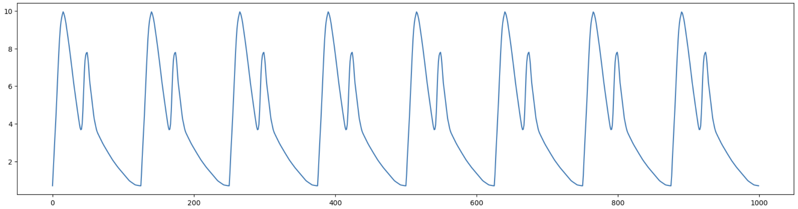
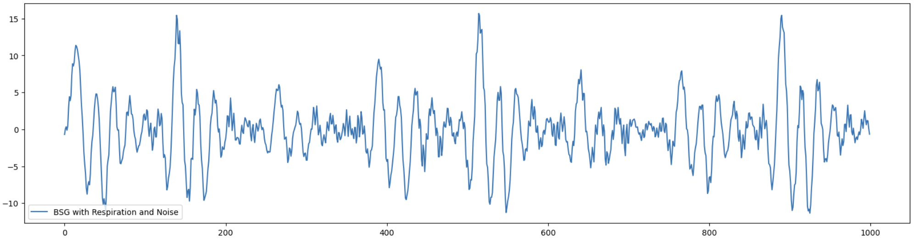

# DataDemo
Cardiorespiratory Time-series Sensor Data Simulation and Demo

## Data simulations

### SCG (Seismocardiogram)

The SCG data simulation is built on the top of NeuroKit2: https://github.com/neuropsychology/NeuroKit

Generate the simulated SCG data:
```
  python3 simscg.py
```

Visualize the saved SCG data npy file:
```
  python3 view_data.py [xxx.npy] [num_labels]
```

Perform clustering of the simulated data on quality evaluation:
```
  python3 evalscg.py
```
### BSG (Bodyseismogram)

Generate the simulated BSG data:
```
  python simbsg.py
```

You can run the test.ipynb to see the visualization of each step

## Description of Data Generation
### BSG (Bodyseismogram)

To evaluate the effectiveness of various models and algorithms, we developed a synthetic BSG signal generation framework that enables the simulation of BSG signals based on specified values of heart rate (HR), stroke volume (SV), and total peripheral resistance (TPR). During the signal generation process, features corresponding to HR, SV, and TPR are systematically embedded into the waveform. The objective of this synthetic dataset is to facilitate the prediction of mean arterial pressure (MAP), which is governed by the physiological relationship:

To evaluate the effectiveness of various models and algorithms, we developed a synthetic BSG signal generation framework that enables the simulation of BSG signals based on specified values of heart rate (HR), stroke volume (SV), and total peripheral resistance (TPR). During the signal generation process, features corresponding to HR, SV, and TPR are embedded into the waveform. The objective of this synthetic dataset is to predict Mean Arterial Pressure (MAP), which satisfies the hemodynamics function:
$$MAP = HR \times SV \times TPR$$
So the key point is how to extract the features that correspond to HR, SV, and TPR, and to synthesize them in a manner that ensures consistency with the MAP formulation above. The specific procedure for generating such signals is detailed as follows:

- ABP Generation

  To generate synthetic ABP, we first manually design a single-cycle ABP waveform template using a graphical drawing tool. This template represents a typical ABP waveform observed in our real dataset and captures the characteristic morphology of a cardiac cycle, including a prominent systolic peak followed by a smaller diastolic peak, as illustrated in the figure below.
  
  
  
  For each synthetic ABP signal, the waveform is systematically modified based on the corresponding HR, SV, and TPR values, and the associated label (MAP) is generated according to the relationship: $MAP = HR \times TPR \times SV$. To embed the effect of TPR into the waveform, we adjust the height of the second peak proportionally to the TPR value. Similarly, the area under the curve from the start point to the dicrotic notch is modified in accordance with the SV. To simulate the heart rate, the designed ABP template is duplicated a number of times corresponding to the specified HR and then resampled to achieve a fixed signal length. The figure below illustrates how the SV and TPR modifications affect the waveform, and the resulting complete ABP signal, representing a 10-second recording sampled at 100 Hz, is shown in the second row.
  
  <p align="center">
    
    
  </p>
  <div style="clear: both;"></div>
  <br>

  
  
- BSG Generation

  The generated ABP signal serves as the envelope for synthesizing the BSG signal. To construct the BSG waveform, we first invert the ABP signal to define the upper and lower envelopes. We then perform alternating sampling between the upper and lower envelopes, maintaining an approximate interval of nine timestamps between consecutive sample points. To preserve the key physiological features associated with SV and TPR, we ensure that critical points of the ABP waveform—specifically the first peak, the dicrotic notch, and the second peak—are included in the sampling process. The result of this alternating sampling is shown in the first-row figure. To enhance the smoothness of the signal and to better approximate the morphology of real BSG waveforms, the sampled points are interpolated using cubic interpolation. The final synthetic BSG signal is presented in the second-row figure.

  
  

- Noise Generation

  To further simulate real-world BSG signals, respiration and random noise components are incorporated into the synthetic waveform. Respiration is modeled as a sinusoidal wave that multiplicatively modulates the BSG signal. The BSG signal with respiration is shown as the figure in the first row. In addition, white noise within the frequency range of 20 to 30 Hz is added to the signal to simulate high-frequency disturbances. The final synthesized BSG signal, incorporating both respiration and noise, is shown in the second-row figure.

  
  